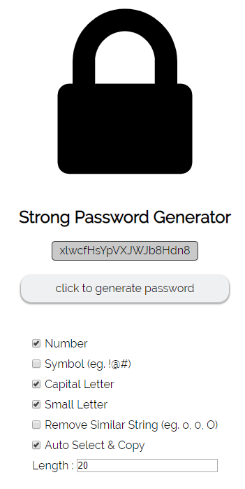

# Strong Password Generator

Creates Strong Passwords with simple JS.
You can generate your password with several options.

1. Number : Add numbers(eg. 0123) to your password.
2. Symbol : Add symbols(eg. !@#$) to your password.
3. Capital Letter : Add capital letters(eg. ABCD) to your password.
4. Small Letter : Add small letters(eg. abcd) to your password.
5. Remove Similar String : get rid of similar strings like o, O, 0 or l, i, I, 1 in your password.
6. Auto Select & Copy : Select and copy your password when you generate it.
